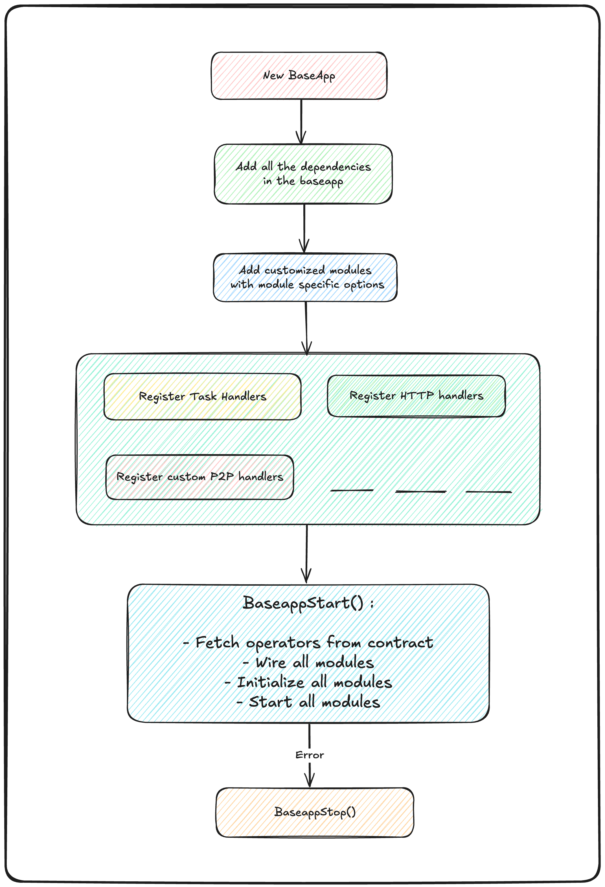

# Catalyst-SDK

Catalyst SDK is a set of modular components to build & operate **SSNs (Shared Security Networks)**. It can be considered as a _Swiss Army Knife_ to build **Universal SSNs**. It enables **plug-and-play** functionality with **full customisability** and provides **standard tooling** to build networks the "right way".

Think of it as "**Cosmos-SDK for building SSNs**". It offers built-in **customizable modules** that facilitate rapid development and flexibility to meet each network's specific needs.

It is written in **Go/Rust**, so it's both performant and fast.

**NOTE: The Catalyst-SDK is currently in Private Devnet. Private Testnet will launch in July 2025.**

# SDK Modules

The following modules are part of the Catalyst-SDK. (not an exhaustive list)

| **Module**      | **Use**                                                                                                                                                                                                                                                                                                                                                                                                                         |
| --------------- | ------------------------------------------------------------------------------------------------------------------------------------------------------------------------------------------------------------------------------------------------------------------------------------------------------------------------------------------------------------------------------------------------------------------------------- |
| **Application** | This module provides interface APIs for developers to implement their business logic. For example, a ZK prover network would use this module to implement the proving and verification logic of ZK proofs.                                                                                                                                                                                                                  |
| **Consensus**   | This module provides implementations of consensus algorithms like [QBFT](https://docs.goquorum.consensys.io/configure-and-manage/configure/consensus-protocols/qbft) and [CometBFT](https://docs.cometbft.com/v0.37/introduction/what-is-cometbft). This is particularly useful for SSNs that require a quorum of nodes to reach agreement on a final result.                                                                   |
| **Networking**  | This module provides APIs to handle all the peer-to-peer (P2P) networking logic. For example, this module can be used to broadcast data to other peers or operators in the network.                                                                                                                                                                                                                                             |
| **Staking**     | This module reads on-chain data to determine the operator set and their associated stakes. Application logic can use this data for leader election, essentially deciding which operator will perform a given task at any specific time.                                                                                                                                                                                         |
| **Slasher**     | This module implements the slashing logic of the network. Slashing actions are signed, broadcast, and verified by all active operators. Once all operators have signed the slashing requests, the slasher module publishes the slashing data on-chain to catalysis contracts for execution.                                                                                                                                 |
| **Rewards**     | This module implements the rewards logic of the network. Rewards are based on actions performed by the application module according to the SSN business logic. The rewards module triggers the on-chain distribution of rewards through catalysis core contracts.                                                                                                                                                           |
| **Crypto**      | This module provides secure private key management with widely adopted signature schemes. It supports [ECDSA](https://en.wikipedia.org/wiki/Elliptic_Curve_Digital_Signature_Algorithm), [BLS](https://eth2book.info/capella/part2/building_blocks/signatures/), and [Schnorr](https://en.wikipedia.org/wiki/Schnorr_signature) signatures, as well as threshold signatures, Shamir Secret Sharing, and popular hash functions. |
| **Cross-Chain** | This module provides cross-chain compatibility for SSN teams, enabling them to execute tasks on any chain of their choice based on their requirements (such as reducing gas fees, faster block times, etc.). It also allows SSNs to distribute rewards and execute slashings from any chain they prefer.                                                                                                                        |

## Core Modules

### 1. Listener Module

The **Listener** module is the entry point of the **Network** pipeline. It acts as an abstract interface for receiving tasks from various sources. These sources could include off-chain APIs, smart contracts events, internal services, or external data feeds.

**Responsibilities:**

- Implemented by all task ingestion modules.
- Collect tasks from one or more **Task Sources**.
- Normalize and validate incoming tasks.
- Forward the valid tasks into the network for consensus and processing.
- Trigger the **Broadcast Task** mechanism that propagates tasks to all nodes.

### 2. Consensus Module

The **Consensus Module** coordinates the distributed agreement on task outcomes. Upon task reception, it ensures each task is processed in a leader-driven yet fault-tolerant manner.

**Core Flow:**

1. **Task Reception:** Upon task reception from listener, the consensus engine starts the task processing round (if it's not already in progress).
2. **Leader Election:** Nodes participate in leader election.
    - If the node is elected leader, it proceeds to execute the task.
    - If not, it waits for the signed result from the leader to attest.
3. **Fallback Handling:**
    - If no signed result is received within the expected time or if a failover is triggered due to a timeout or faulty leader, a new leader is elected for the next round, and the process is repeated.
    - The system continues initiating new rounds whenever the leader fails to deliver a signed result before the round timeout, until the overall task timeout is reached.

**Responsibilities:**

- Manage task lifecycle and deduplicate concurrent attempts.
- Elect a leader per task round. (do not consider previous leader in the next round election leader mechanism)
- Ensure results are signed by the leader and shared with the network.
- Relay the `SignedResult` to the **Execution Module** for further attestation.

### 3. Execution Module

The **Execution Module** validates the `SignedResult` received from the Consensus Module and initiates a collective attestation process.

**Core Flow:**

1. Receives `SignedResult`.
2. Validates the result and prepares attestation.
3. Broadcasts attestation to the network.
4. Waits for peer attestations and aggregates them.
5. On quorum completion, forwards the aggregated attestations to the **Submitter Module**.

**Responsibilities:**

- Validate the correctness of the signed task result.
- Broadcast attestation to other peers.
- Listen and store incoming attestations from the network.
- Monitor attestation threshold: wait until enough attestations are collected to meet the protocol's requirement.

**Built-In Resilience:**

- Attestation timeout recovery.
- Resubmission or rollback on attestation mismatch.

### 4. Submitter Module

The **Submitter Module** is responsible for finalizing the task by committing the result on-chain and triggering any post-processing logic.

**Responsibilities:**

- Submit the aggregated attestation set to the `TaskManager` smart contract.
- Ensure transaction inclusion and confirmation on the blockchain.
- Invoke custom post-submission logic provided by the SSN developer (e.g., callbacks, rewards distribution, logging, etc.).
- Handle retries in case of failed on-chain submission.

**Security Considerations:**

- Re-check attestation correctness before submission.

## **Supporting Libraries**

1. **Crypto Library** – Manages key generation, signing, and cryptographic operations for supported key types.
2. **P2P Networking Library** – Facilitates operator communication via peer discovery, relay, and message broadcasting.
3. **Observability Library** – Provides monitoring (Prometheus/Grafana), tracing (Jaeger), logging (Loki), and performance profiling (pprof).

## **Flow Diagram**

