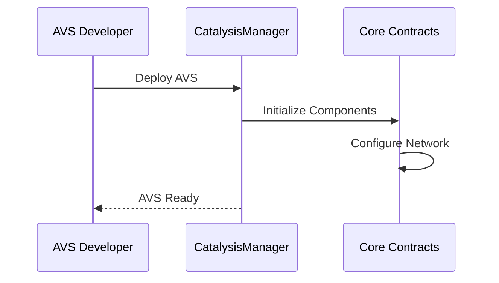
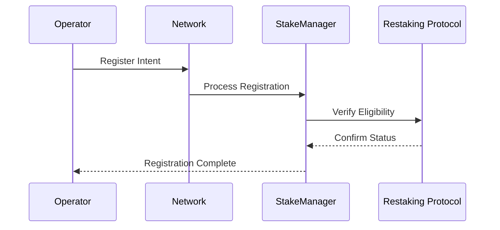
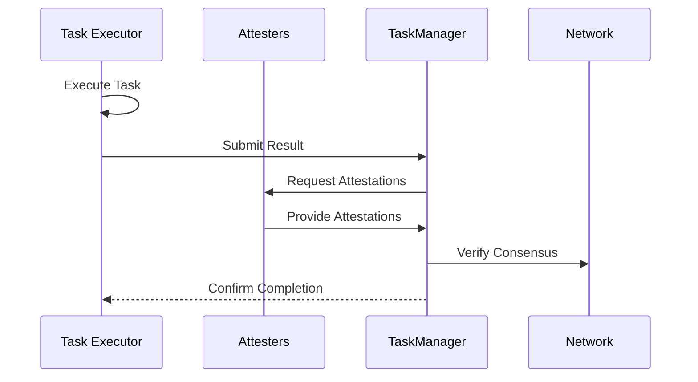

# Smart Contracts

Catalysis utilizes a sophisticated smart contract architecture to enable secure, scalable AVS deployment and management. Our contracts serve as the foundational layer that bridges AVS developers with multiple restaking protocols, providing unified access to economic security.

## Architecture Overview

The Catalysis smart contract system employs a modular, upgradeable architecture designed for flexibility and security. At its core, the system consists of several interconnected components that work together to manage AVS lifecycle, operator registration, task execution, and economic incentives.

## Core Components

### CatalysisManager

The factory contract that serves as the entry point for deploying new AVS instances. It manages the deployment of all core contracts and maintains upgradeability through beacon proxy patterns.

**Key Capabilities:**

- **AVS Deployment**: Streamlined deployment of complete AVS infrastructure
- **Upgradeable Architecture**: Secure upgrade mechanisms for evolving protocol needs
- **Configuration Management**: Centralized management of system parameters

### NetworkManager  

The orchestration layer that manages AVS operations and administrative functions. This contract serves as the primary interface for AVS configuration and operator management.

**Key Capabilities:**

- **Operator Registration**: Seamless onboarding of network operators
- **Committee Management**: Dynamic assignment and management of operator committees
- **Administrative Controls**: Comprehensive governance and parameter management

### StakeManager

The economic security layer that interfaces with multiple restaking protocols to aggregate and manage operator stakes across different platforms.

**Key Capabilities:**

- **Multi-Protocol Integration**: Native support for Symbiotic, with EigenLayer and others coming soon
- **Stake Aggregation**: Real-time tracking of operator stakes across multiple vaults
- **Committee Assignment**: Intelligent stake-weighted operator assignment to committees

### TaskManager

The execution layer that handles task submissions, attestations, and consensus mechanisms for AVS operations.

**Key Capabilities:**

- **Flexible Task Execution**: Support for various task types and execution patterns  
- **Multi-Signature Support**: Both ECDSA and BLS signature schemes for different use cases
- **Consensus Mechanisms**: Configurable voting thresholds and approval processes
- **Zero-Knowledge Integration**: Support for ZK proof-based task verification (coming soon)

## Restaking Integration

Catalysis seamlessly integrates with leading restaking protocols through specialized adapter modules:

### Symbiotic Integration

- **Native Support**: Direct integration with Symbiotic's vault and delegation architecture
- **Flexible Staking**: Support for both NetworkRestake and FullRestake delegation models
- **Real-time Updates**: Dynamic stake tracking and committee rebalancing

### Multi-Protocol Future

- **EigenLayer**: Integration in active development
- **Extensible Design**: Architecture ready for additional restaking protocols

## Economic Incentives

### Rewards Distribution

- **Performance-based**: Rewards tied to successful task completion and network participation
- **Proportional Allocation**: Stake-weighted reward distribution
- **Cross-protocol**: Unified reward mechanisms across all integrated restaking platforms

### Risk Management

- **Graduated Slashing**: Proportional penalties based on violation severity  
- **Committee Isolation**: Localized risk containment within committee structures
- **Appeal Mechanisms**: Governance-based resolution for disputed actions

## Developer Benefits

### Simplified Integration

- **Unified Interface**: Single integration point for multiple restaking protocols
- **Reduced Complexity**: Abstract away protocol-specific implementation details
- **Flexible Configuration**: Customizable parameters for diverse AVS requirements

### Economic Security

- **Aggregated Stake**: Access to combined economic security from multiple protocols
- **Dynamic Scaling**: Automatic adjustment of security levels based on stake availability
- **Risk Distribution**: Spread economic risk across multiple restaking platforms

### Operational Efficiency

- **Automated Management**: Streamlined operator and committee management
- **Real-time Monitoring**: Continuous tracking of network health and performance
- **Upgradeable Infrastructure**: Future-proof architecture that evolves with ecosystem needs

## Contract Interactions

Understanding how Catalysis contracts interact provides insight into the protocol's operational flow. Below are the key interaction patterns that enable secure, scalable AVS operations.

### AVS Deployment

The deployment process establishes a complete AVS infrastructure through a single transaction, automatically configuring all necessary components for immediate operation.

### Operator Onboarding

Operators join the network through a streamlined process that verifies their eligibility and establishes their participation across all integrated restaking protocols.

### Task Execution Flow

The task execution model ensures integrity through multi-party attestation and consensus verification, providing robust validation of all network operations.

## Getting Started

For AVS developers looking to leverage Catalysis smart contracts:

1. **Architecture Planning**: Review your AVS requirements and determine optimal committee structure
2. **Integration Design**: Plan your task execution flow and attestation mechanisms  
3. **Deployment Preparation**: Prepare operator network and restaking protocol integrations
4. **Testing Environment**: Utilize our testnet for comprehensive integration testing

## Next Steps

Ready to build with Catalysis? Explore our [Integration Guide](./05-integration.md) for detailed implementation steps, or dive into our [SDK documentation](./03-catalyst-sdk.md) for development tools and examples.

For technical support and architectural guidance, connect with our team through our developer channels.
