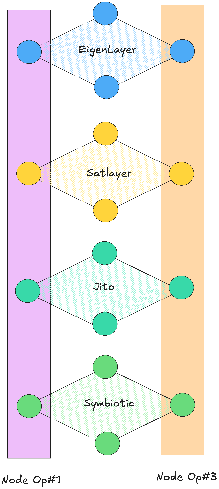

# Running a Node

You can run a node using the docker image or the binary of the Network built using the Catalyst-SDK.

## How does it work?

The following is the view from the perspective of a node operator running a Network built using Catalysis.

- The Network is sourcing economic security across EigenLayer, Symbiotic, Satlayer and Jito.
- Each node operator runs a single instance of a Catalysis node client software.

