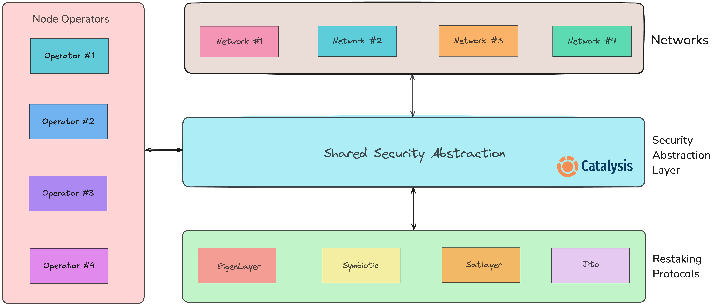

# Overview

## Catalysis Core

**Catalysis Core** is the first Security Abstraction Layer that unlocks **Unified Access to $20B+ ETH, BTC & SOL-backed Economic Security** across major restaking protocols on Ethereum, Bitcoin & Solana.

It introduces a new primitive called **Shared Security Abstraction (SSA)** that separates application logic from the complexities of underlying restaking infrastructure. By standardizing interactions across protocols like EigenLayer, Symbiotic and SatLayer, **Catalysis Core** allows applications and networks to consume restaked security through a single, abstract interface.

## Core Architecture Overview

The **Catalysis Core** is built on three core components:
1. **Networks** – Decentralized services, protocols and applications (SSNs) that leverage shared security for verification and decentralization.
2. **Node Operators** – Entities that run network software, perform validation tasks and secure them using the Catalysis stack through restaking protocols.
3. **Restaking Protocols** – Also known as shared security protocols, these allow stakers to restake assets (LSTs, ERC-20s, etc.) to provide security for network validation. They function as a marketplace, connecting networks, node operators and stakers.

## Why build with Catalysis Core?

Shared security protocols like EigenLayer, Symbiotic and Satlayer have unlocked a new paradigm for decentralized infrastructure by making it easier to bootstrap decentralized networks (SSNs). **However, launching and managing an SSN remains complex and resource-intensive**.

Teams must navigate a wide range of challenges. This includes integrating with restaking protocols, configuring slashing and reward mechanisms, managing a node operator set and ensuring cross-restaking protocol composability.

**Catalysis Core** eliminates these barriers, making it easier, faster and more cost-efficient to build and operate SSNs.

## Key Benefits

The key benefits of building an SSN using **Catalysis Core** include:

1. **Multi-Ecosystem Security:** Seamlessly integrate restaking protocols across major PoS chains like **Babylon (Bitcoin), Ethereum and Solana**.
2. **Accelerated GTM:** Launch faster with developer-friendly SDKs, clear documentation and up to **80% savings on SSN development costs**.
3. **Unmatched Economic Security:** Tap into **$20B+ in combined TVL** across restaking protocols - ensuring your SSN has the strongest possible security guarantees.
4. **Resilient Infrastructure:** Spread risk across multiple restaking protocols, ensuring your SSN is **robust and reliable** even in adverse conditions across the restaking ecosystem.
4. **Composability at Scale:** Unlock **composable, interoperable crypto-economic security** across restaking protocols.
5. **No Vendor Lock-In:** Stay flexible with **modular integrations**, enabling your SSN to expand beyond one ecosystem.
6. **Dynamic Security Rebalancing:** Real-time control to allocate and **rebalance security** across restaking protocols with a **single unified interface**.

It isn't just about simplifying SSN development - **it’s about unlocking the full potential of shared security**.

## The Restaking Stack

