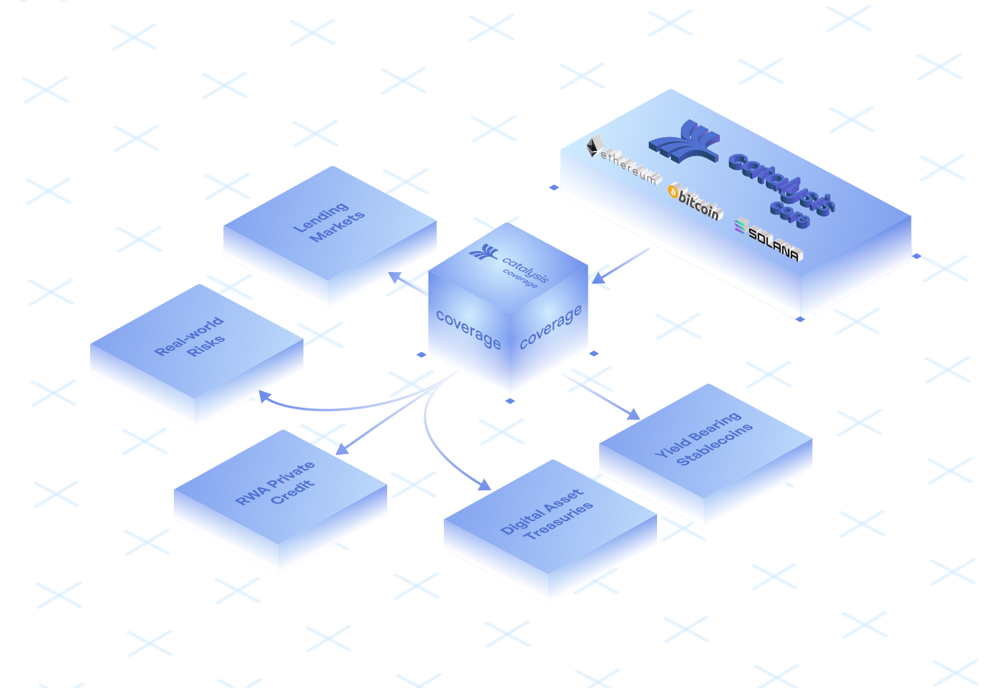

# Overview

**Catalysis Coverage is a programmable risk coverage protocol purpose-built for institutions**. It transforms $20B+ in restaked capital into active protection across **onchain credit, stablecoins, structured yield products & real-world risks.**

Catalysis Coverage streamlines onchain risk protection by abstracting away the complexities of underlying restaking protocols. Through a unified interface, institutions gain seamless access to restaked capital for key operations — **from policy underwriting and premium collection to claims processing and payout execution.**

**Coming soon.**

## Features

1. **Programmable, Fully Onchain**

Smart contracts handle dynamic real-time premium pricing, automated underwriting, onchain claims assessment and fast payouts.

2. **Institution-First Design**

Purpose-built for institutions, with legal enforceability and compliance-ready contracts.

3. **$20B+ Underwriting Capacity**

A deep pool of restaked digital assets (BTC, ETH, SOL) backs every policy, unlocking massive cover sizes for institutional-DeFi. 

4. **Simplified Integration UX**

Coverage can be plugged into any protocol with minimal effort, no custom infra needed.
