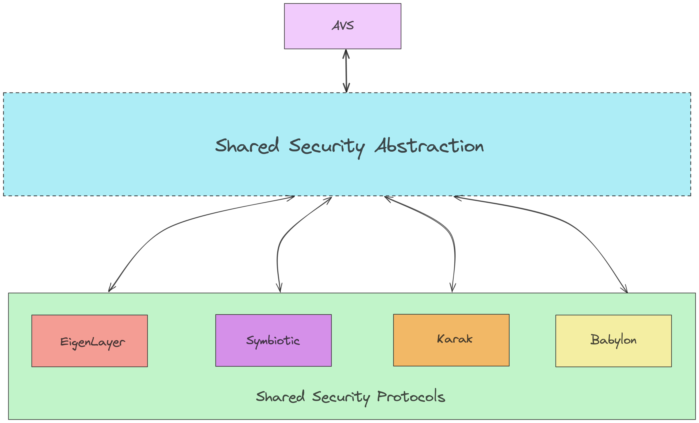
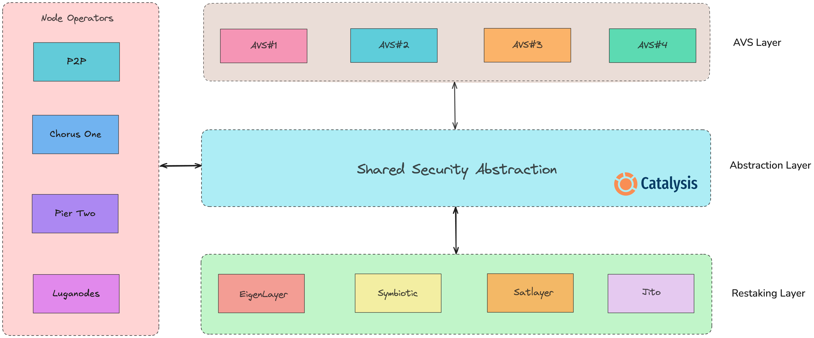

# Overview

## Shared Security Abstraction

**Shared Security Abstraction (SSA)** is a new primitive that abstracts the complexities of underlying shared security protocols from AVS developers. It aggregates both the supply-side (shared security protocols) and the demand-side (AVSs) of restaking ecosystem.

This saves teams 80% on costs of building and managing AVSs.

## The Restaking Stack (Simplified)

## The Restaking Stack (Expanded)

