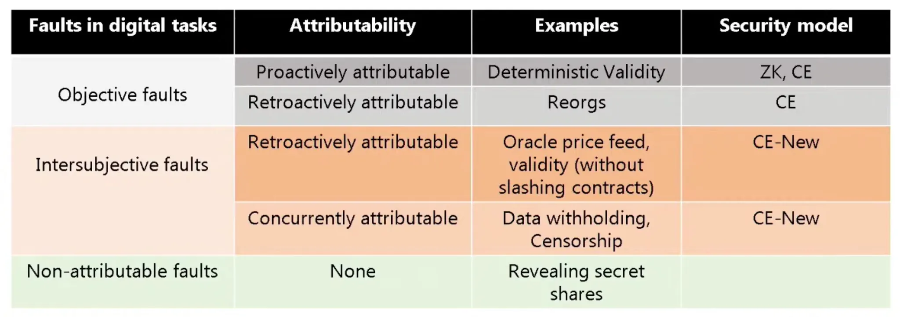

# FAQs

1. **How easy is it to build a Network using Catalysis?**

Building a Network using Catalysis is fast and seamless. With Catalyst-SDK, you can have your Network up and running in just a few days, saving 80% of time and resources compared to building from scratch.

2. **How does Catalysis make Networks more resilient?**

Catalysis ensures resilience by distributing your Network’s security across multiple shared security protocols (SSPs). This minimizes the impact of any single protocol failure.

**Example:**
If your Network is secured by EigenLayer, Symbiotic, Kernel, and SatLayer, and Kernel faces a security breach or a major liquidity migration, your Network remains secure because it still has economic backing from EigenLayer, Symbiotic and SatLayer.

3. **How does Catalysis compare to other shared security protocols (SSPs)?**

Catalysis is **NOT** a shared security protocol - it is a **Security Abstraction Layer** that connects major SSPs like EigenLayer, Symbiotic and Satlayer.

With Catalysis, Networks can seamlessly integrate with multiple SSPs instead of being tied to just one. This results in:
- **Greater flexibility** → Choose where to source security dynamically.
- **Higher resilience** → Avoid dependency on a single SSP.
- **Optimized security costs** → Compete for the best economic security pricing.

4. **Isn't ZK verifiability enough for my Network?**

No, ZK verification is not enough as it cannot solve for all kinds of faults. ZK is a valid security model only under the assumption of **objective faults** that are **proactively attributable**.

However, not all security risks fall into this category.

