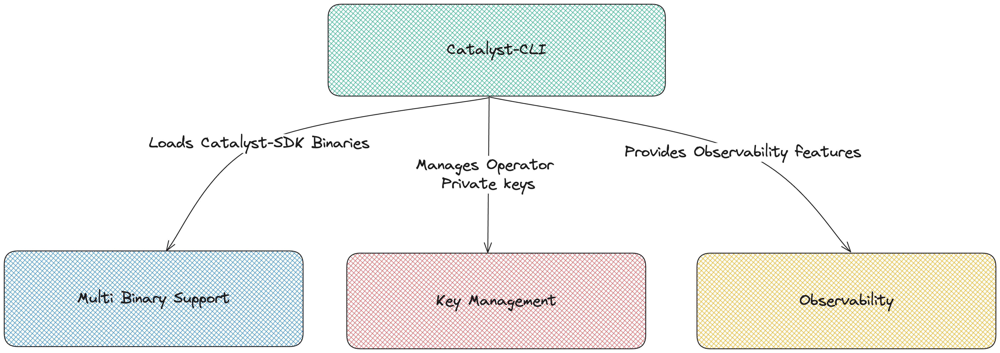

# Catalyst-CLI

Catalyst-CLI is a command line tool for node operators to **easily manage AVS infrastructure** across different restaking protocols.

It works particularly well with AVSs built using Catalyst-SDK, creating a synergistic combination of AVS building & infrastructure management.

Features:

- Think of it as “**Kubernetes for managing AVS infra”**.
- Offers **unified node setup** for AVSs distributed across multiple restaking protocols.
- Includes key management, setup & monitoring among other features.

### 1. Multi Deployment Support

- Efficiently manages multiple AVS binaries at once.
- Load docker images built using catalyst-sdk.
- Also run your **full** or **validator** node as a systemd process
- Handle AVS upgrades gracefully.

### 2. Key Management

- Efficiently manages private keys of node operators across multiple shared security protocols.
- Provides a single unified key management solution.
- Supports variety of key management solutions like on disk, KMS ([AWS](https://aws.amazon.com/kms/), [HashiCorp](https://developer.hashicorp.com/vault/docs/secrets/key-management/awskms)), Remote Signer ([web3signer](https://docs.web3signer.consensys.io/)), etc.

### 3. Observability

- Provides a single observability view to manage AVS operations across multiple restaking platforms efficiently.
- Provides all the essential observability features such as:

| **Feature**                                                                            | **Use**                                                                               |
| -------------------------------------------------------------------------------------- | ------------------------------------------------------------------------------------- |
| [**Prometheus**](https://prometheus.io/)                                               | Pulls metrics for Grafana dashboard and Alert Manager                                 |
| [**Grafana**](https://grafana.com/)                                                    | Visual dashboard for metrics                                                          |
| [**Loki**](https://grafana.com/oss/loki/)                                              | Provides log aggregation system and metrics                                           |
| [**Profiling**](https://github.com/google/pprof)                                       | Valuable for debugging via tools like pprof                                           |
| [**Tracing**](https://go.dev/doc/diagnostics)                                          | Debugging using tracing                                                               |
| [**Alert manager**](https://grafana.com/docs/grafana/latest/datasources/alertmanager/) | Manages alerts when certain thresholds cross (say 5% of AVS stake slashed)            |
| **Runtime statistics**                                                                 | Collection and analysis of runtime stats for a high-level overview of AVS performance |
